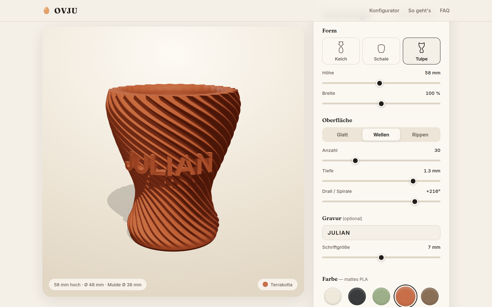
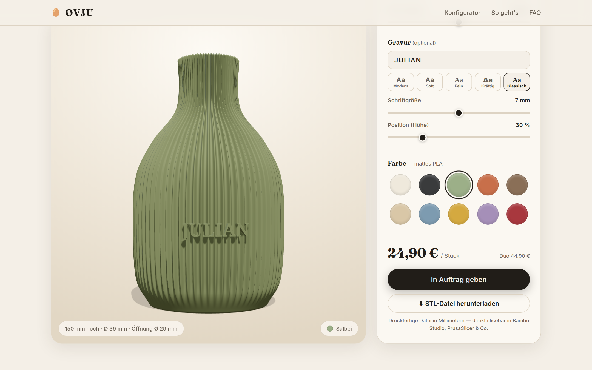
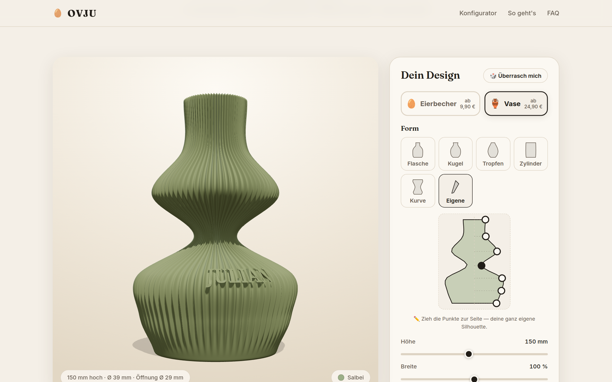

# 🥚 OVJU — Julians Eierbecher

**Dein Ei. Dein Design.** — Web-Konfigurator für individuell designte, 3D-gedruckte **Eierbecher und Vasen**.





## Features

- **Zwei Produktwelten**: Eierbecher (Kelch/Schale/Tulpe) und Vasen (Flasche/Kugel/Tropfen/Zylinder/Kurve), Höhe & Breite frei ziehbar
- **Formen-Editor „Eigene"**: Silhouetten-Punkte per Drag ziehen — komplett eigene Formen
- **Oberflächen**: Glatt, Rippen, Wellen, **Lamellen** (tiefe Plissee-Schlitze bis 6 mm, Iconic-Home-Look), Zickzack (Facetten), Querwellen, **Gehämmert** (gejittertes Kugelkalotten-Gitter mit Facettenkanten — wie handgehämmertes Metall, reproduzierbar) — mit Anzahl, Tiefe und **Verlauf**: Spirale, Gegenläufig (V-Optik), Wellenfluss (schlängelnde Rippen) oder Zickzack, jeweils mit Stärke und Anzahl Richtungswechsel. Ästhetik-Klemmen (aus einem Multi-Agent-Design-Review abgeleitet) halten jede Kombination kontrolliert: Rippenlinien-Neigung ≤ 55–62°, Tiefe an Rippenzahl gekoppelt, Wechselzahl an Rippendichte/Höhe gekoppelt, Muster laufen an den Rändern sauber aus
- **Größenaufschlag**: Preis wächst mit dem Volumen relativ zur Normalgröße (relVol = Höhe/Normalhöhe × Breite²; %- und €-Satz im Admin einstellbar, live im Konfigurator sichtbar, Server rechnet verbindlich)
- **Gravur**: zuschaltbares Extra (Aufpreis im Admin einstellbar, Standard 3 €), 7 Schriftarten (inkl. „Edel" Marcellus & „Kalligrafie" Great Vibes, OFL → Lizenzen in docs/LICENSES.md), Größe & Höhen-Position einstellbar; der Text folgt der Silhouette (Taille/Bauch) und wird um die Wand gebogen
- **10 matte PLA-Farben** (Bambu-Lab-Palette, definiert in `public/content.json`)
- **Galerie & Produktfotos**: Im Admin (🖼️ Bilder) hochgeladene Fotos erscheinen sofort in der „Zuhause bei OVJU“-Galerie; Fotos der Kategorie Eierbecher/Vase ersetzen die Render-Bilder der Produktkarten
- **Szenen-Vorschau**: Studio + 4 fotoreale CC0-HDRI-Szenen von Poly Haven (Esstisch mit echter Holztisch-Textur, Fensterbrett mit Ausblick, Café, Abend) — Environment-Beleuchtung, Ei im Becher bzw. Trockengräser in der Vase
- **📸 Foto-Shooting**: rendert das aktuelle Design in 4 Szenen als speicherbare PNGs
- **Untersetzer-Extra** (+4,90 €): Schale mit Sitz-Mulde für den Becher, fängt Eierschalen auf; wandert als zweites Teil mit in die STL (nebeneinander auf dem Bett)
- **STL-Export** direkt im Browser: binär, Millimeter, **wasserdicht/manifold** — slicebar in Bambu Studio, PrusaSlicer & Co.
- **Shop-System**: Warenkorb mit konfigurierbaren **Mengenrabatten** (gleiches Design mehrfach → z. B. −35 % ab 4 Stück), Checkout mit Lieferadresse, **Rechnungserstellung** (Firmendaten, § 19 UStG oder USt, fortlaufende Nummern), Vorkasse + **PayPal-Anbindung** (REST, Sandbox/Live — nur Zugangsdaten eintragen)
- **Admin-Zentrale** (`/admin`, Standard-Passwort `ovju-admin` — bitte ändern!):
  - 📊 Dashboard: Umsatz (gesamt/30 Tage), offene Drucke, Ø Bestellwert, meistbestellte Farben & Produkte
  - 📦 Bestellungen: Suche & Status-Filter, aufklappbare Details, Sendungsnummer, interne Notizen, E-Mail-Vorlagen (Zahlungserinnerung/Druckstart/Versand), CSV-Export
  - 🎨 Filament-Farben: einpflegen/deaktivieren/löschen mit Farbwähler & Bestandsnotiz — wirkt sofort auf die Farbauswahl im Konfigurator
  - 💰 Preise & Mengenrabatt-Stufen, 🎟️ Gutscheine (%- oder €-Codes, Mindestbestellwert)
  - 🏢 Firma (Rechnungsdaten), 💙 PayPal, ⚙️ Passwort & JSON-Backup — alles in `data/settings.json` (nicht im Git)
- **Kundenkonten**: Registrierung/Login (scrypt-gehashte Passwörter, Sessions in `data/`), Bestellhistorie mit Status & Rechnungen, Standard-Lieferadresse mit Checkout-Vorbefüllung
- **Darkmode**: Umschalter im Header (🌙/☀️), merkt sich die Wahl, folgt sonst der Systemeinstellung
- **Druckbarkeits-Ampel**: analysiert live die Flächennormalen des Meshes (Überhangwinkel) — ✅/⚠️/🔶 direkt im Konfigurator; Querwellen werden serverseitig auf druckbare Wellenlängen/Tiefen geklemmt (`tools/check-printability.mjs` für Offline-Analysen)
- **Rechtliche Produkthinweise** an fünf Stellen (Konfigurator bei Vase & Eigener Form, Checkout, FAQ, Footer, Rechnung): Trockenblumen-Zweck, imprägniert/i. d. R. wasserfest ohne Gewähr, keine Standfestigkeits-Garantie bei freien Formen, pflanzenbasiertes PLA
- Kein Build-Schritt, keine Runtime-Dependencies — alles lokal gevendort (Three.js, Fonts)

## Starten

```bash
node server.js          # → http://localhost:4488
```

| Route | Zweck |
|---|---|
| `/` | Landingpage + Konfigurator |
| `/admin` | Admin: Bestellungen, Status, Einstellungen (Passwort: `ovju-admin`) |
| `/api/pricing`, `/api/quote` | Preise & Rabatte (Server = einzige Preisquelle) |
| `/api/checkout` + STL-Upload | Warenkorb-Bestellung anlegen, Modelle binär hochladen, Rechnung erzeugen |
| `/api/paypal/*` | PayPal-Order anlegen/einziehen (aktiv, sobald Zugangsdaten hinterlegt) |

## Struktur

```
server.js                  Node-HTTP-Server (Port 4488, keine Dependencies)
public/
  index.html               Landing + Konfigurator
  css/style.css            Design (warm-minimal, Fraunces/Inter lokal)
  js/geometry.js           Parametrische Becher-Geometrie (manifold, mm)
  js/exporter.js           Binärer STL-Export
  js/app.js                3D-Szene, UI, Bestellflow
  content.json             Texte, Farben, Preise (Marketing)
  vendor/, fonts/          Three.js r160 + Schriften, lokal
orders/                    Eingegangene Bestellungen (nicht im Git)
tools/
  check-stl.mjs            STL-Validator (watertight, Volumen, BBox …)
  generate-stl.mjs         STL per CLI erzeugen (Tests/Repro)
docs/marketing.md          Marketing-Plan (Positionierung, Pricing, Social)
```

## Qualitätssicherung

```bash
npm run setup   # einmalig: three-Symlink für die CLI-Tools
npm run check   # erzeugt Referenz-STL und validiert sie
node tools/check-stl.mjs orders/<ID>/<datei>.stl   # Bestellung prüfen
```

Der Validator prüft: Dateikonsistenz, degenerierte Dreiecke, NaN, Bounding Box,
Watertightness (jede Kante exakt gepaart) und positives Volumen.

## Druckbarkeit der Muster (gemessen mit tools/check-printability.mjs)

Bewertung (UI-Ampel und `tools/check-printability.mjs`): **Silhouette** (Grundform) streng — >50° ⚠️, >62° ❌;
**Muster-Flanken** sind selbsttragende Mikro-Features (Tiefe ≤ 1,6 mm < 2-mm-Faustregel) und höchstens ⚠️.
Querwellen werden zusätzlich serverseitig auf druckbare Wellenlänge/Amplitude geklemmt.

## Druck-Empfehlung (Bambu Studio)

- Material: **PLA matt**, Schichthöhe 0.16–0.20 mm
- 3 Wandlinien, 10–15 % Infill, kein Support nötig (Mulde ≤ 45°)
- Becher/Vase stehen flach auf dem Bett — einfach STL öffnen, Farbe wählen, slicen
- Vasen sind geschlossene Hohlkörper (2,2 mm Wand + Boden) — normal slicen, kein Vasenmodus nötig
