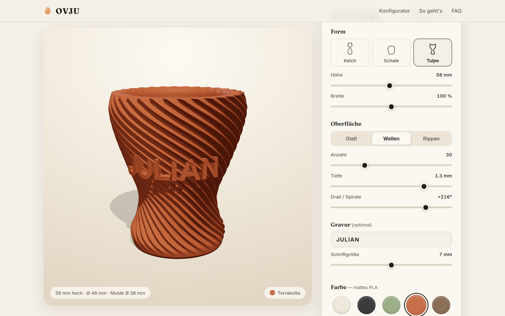
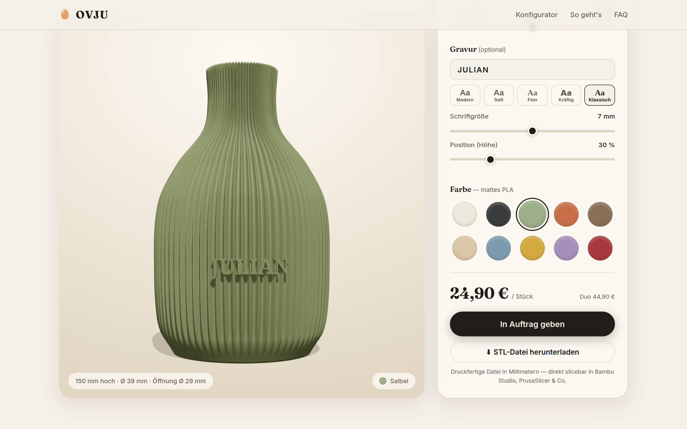
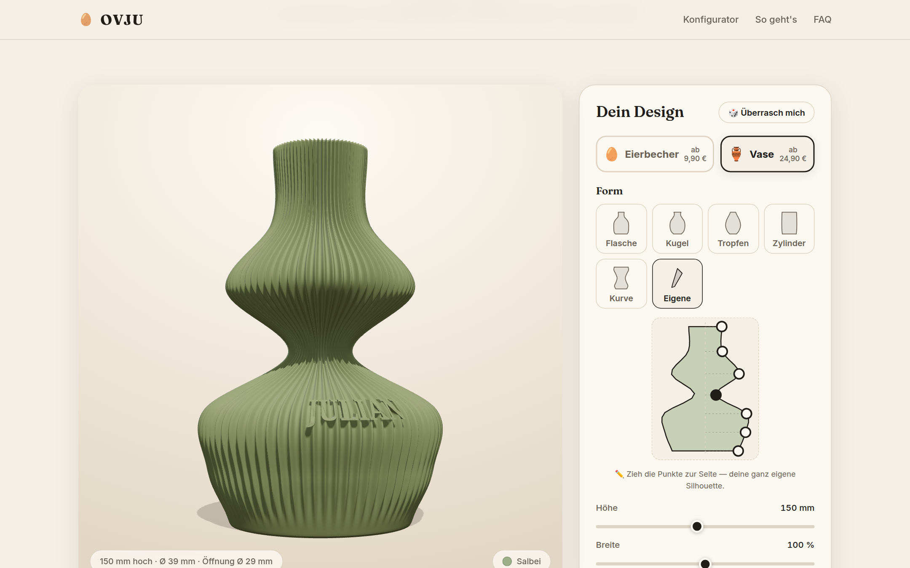

# formsam — Vasen selbst gestalten

**Sorgsam geformt. Auf dich zugeschnitten.** — Web-Konfigurator und Shop für individuell gestaltete, 3D-gedruckte **Vasen**.
Du entwirfst Form, Oberfläche, Farbe und Gravur live in 3D; gedruckt wird erst, wenn bestellt wird — einzeln, in Deutschland, aus PLA.

Marke, Farben, Schriften und Logo-Dateien: [docs/marke.md](docs/marke.md).

> **Eierbecher sind per Schalter deaktiviert** (Admin → System → „Eierbecher als Produkt anbieten“, Standard: aus).
> Code, Geometrie, alte Bestellungen und gespeicherte Designs bleiben erhalten; der Server nimmt Eierbecher-Positionen
> nicht an, solange der Schalter aus ist. Einschalten macht das Produkt ohne Code-Änderung wieder bestellbar.





## Studio-Redesign

Interaktive 3D-Formenwelt mit sechs direkt übernehmbaren Entwürfen, Live-Silhouetteneditor, KI-Produktfotos auf Basis der tatsächlichen Modelle, Scroll-Animationen, Darkmode und responsivem Layout. Die Szenen pausieren außerhalb des Sichtbereichs und respektieren reduzierte Bewegung. Gestaltung und Bildherkunft: [docs/studio-redesign.md](docs/studio-redesign.md).

## Oberflächen & Szenen

15 neu generierte FDM-Motive: sechs Formenkarten, vier Kampagnenszenen, drei Hammerschlag-Nahaufnahmen sowie Voronoi und Fjordwelle. Alle Materialien zeigen horizontale Druckschichten, auch glänzendes und metallisch schimmerndes PLA. Optimierte WebP-Dateien werden auf der Website verwendet; die PNG-Originale und exakten Prompts sind unter [Bilder und Prompts](docs/generated-scenes.md) dokumentiert.

**Voronoi** (Muster-ID `skelett`): Vasen erhalten echte unregelmäßige Zellöffnungen mit verbundenen Stegen, stabilem Fuß und geschlossenem Rand. (Eierbecher — derzeit deaktiviert — behalten eine geschlossene Mulde und zeigen das Muster als Relief.) Gravuren erhalten eine geschlossene Auflage. Prüfung: `node tools/check-skeleton.mjs` und `node tools/check-voronoi-topology.mjs`.

**Fjordwelle** (Muster-ID `koralle`): feine geschwungene Rippen auf weiten Wellen. Die Oberfläche bleibt geschlossen; Tiefe bis 6 mm bei Vasen. Prüfung: `node tools/check-coral.mjs`.

Die sieben ursprünglichen Muster bleiben geometrisch unverändert. Ein physischer Probedruck der neuen Muster steht aus; bei Voronoi sind Brücken und gegebenenfalls Stützen im Slicer zu prüfen.

## Features

- **Vasen** (Flasche/Kugel/Tropfen/Zylinder/Kurve), Höhe & Breite frei ziehbar. Eierbecher (Kelch/Schale/Tulpe) sind im Code vorhanden, aber per Schalter deaktiviert (siehe oben)
- **Formen-Editor „Eigene"**: Silhouetten-Punkte per Drag ziehen — komplett eigene Formen
- **Oberflächen**: Glatt, Rippen, Wellen, **Lamellen** (tiefe Plissee-Schlitze bis 6 mm), Zickzack (Facetten), Querwellen, **Gehämmert** (gejittertes Kugelkalotten-Gitter mit Facettenkanten — wie handgehämmertes Metall, reproduzierbar), **Voronoi** und **Fjordwelle** — mit Anzahl, Tiefe und **Verlauf**: Spirale, Gegenläufig (V-Optik), Wellenfluss (schlängelnde Rippen) oder Zickzack, jeweils mit Stärke und Anzahl Richtungswechsel. Ästhetik-Klemmen (aus einem Multi-Agent-Design-Review abgeleitet) halten jede Kombination kontrolliert: Rippenlinien-Neigung ≤ 55–62°, Tiefe an Rippenzahl gekoppelt, Wechselzahl an Rippendichte/Höhe gekoppelt, Muster laufen an den Rändern sauber aus. Mesh-Ringe drehen mit dem Verlauf mit und die Auflösung ist ein ganzzahliges Vielfaches der Rippenzahl → Gratspitzen liegen auf jedem Ring exakt auf einem Vertex (keine „Perlenketten“ bei Drall)
- **Aktionen**: Rabatt je Muster, mehrere Aktionen gleichzeitig, Badges und Umschalt-Hinweis im Konfigurator (Admin → Aktionen)
- **Größenaufschlag**: Preis wächst mit dem Volumen relativ zur Normalgröße (relVol = Höhe/Normalhöhe × Breite²; %- und €-Satz im Admin einstellbar, live im Konfigurator sichtbar, Server rechnet verbindlich)
- **Gravur**: zuschaltbares Extra (Aufpreis im Admin einstellbar, Standard 3 €), 7 Schriftarten (inkl. „Edel" Marcellus & „Kalligrafie" Great Vibes, OFL → Lizenzen in docs/LICENSES.md), Größe & Höhen-Position einstellbar; der Text folgt der Silhouette (Taille/Bauch) und wird um die Wand gebogen
- **16 PLA-Farben mit Finishes**: matt (Bambu-Matte-Palette), glänzend (Glossy) und metallic/Silk (Gold, Silber, Kupfer, Perlmutt) — Finish pro Farbe im Admin einstellbar, gerendert mit MeshPhysicalMaterial (Clearcoat/Metalness) + RoomEnvironment-Reflexionen im Studio
- **Galerie & Produktfotos**: Im Admin (Produktfotos & Galerie) hochgeladene Fotos erscheinen sofort in der „Zuhause bei formsam“-Galerie; Fotos der Kategorie Vase ersetzen die Render-Bilder der Produktkarten
- **Szenen-Vorschau**: Studio + 4 fotoreale CC0-HDRI-Szenen von Poly Haven (Esstisch mit echter Holztisch-Textur, Fensterbrett mit Ausblick, Café, Abend) — Environment-Beleuchtung, Trockengräser in der Vase
- **📸 Foto-Shooting**: rendert das aktuelle Design in 4 Szenen als speicherbare PNGs
- **Design-Codes & Listen**: jedes Design als kurzer Code zum Teilen und Nachbestellen (alte Codes bleiben gültig), Design-Listen (z. B. für eine Hochzeit) mit Vorschau, Code und Menge — teilbar per Link
- **STL-Export** direkt im Browser: binär, Millimeter, **wasserdicht/manifold** — slicebar in Bambu Studio, PrusaSlicer & Co.
- **Shop-System**: Warenkorb mit konfigurierbaren **Mengenrabatten** (gleiches Design mehrfach → z. B. −35 % ab 4 Stück), Checkout mit Lieferadresse, Vorkasse + **PayPal-Anbindung** (REST, Sandbox/Live — nur Zugangsdaten eintragen)
- **Bestellnummern** `FS-YYMMDD-XXXXXX`; ältere Bestellungen mit `OV-…` bleiben überall gültig (Konto, Admin, Widerruf)
- **Rechnungen & Gutschriften**: Firmendaten, § 19 UStG oder USt, fortlaufende Nummern mit **automatischem Jahreswechsel** (steht im Präfix eine Jahreszahl, z. B. `RE-2026-`, stellt der Shop sie beim ersten Beleg im neuen Jahr um und beginnt wieder bei 1). Ausgestellte Belege (`orders/<ID>/rechnung.html`, `gutschrift.html`) werden **nie neu geschrieben** — alte Rechnungen behalten ihr damaliges Aussehen (GoBD), nur neue Belege erscheinen im formsam-Design
- **E-Mails** (`lib/mailer.js`, `lib/mail-templates.js`, SMTP ohne Dependencies): Bestellbestätigung mit Lieferzeit und „Gedruckt wird erst, wenn du bestellst.“, Willkommen, Passwort, Status-Mails, Reklamation, Widerrufs-Eingang; Kopf mit Logo-Bild von der eigenen Domain (`/img/brand/formsam-mail.png`), Fußzeile mit Anbieter und Links zu Impressum · Datenschutz · AGB · Widerruf. Ohne SMTP landen Mails nur im Protokoll `data/mail-outbox.json`. Test: `node tools/mail-test.mjs --smoke`
- **Admin-Zentrale** (`/admin`, Standard-Passwort bei Neuinstallation `formsam-admin` — bitte sofort ändern!):
  - Übersicht: Umsatz (gesamt/30 Tage), offene Drucke, Ø Bestellwert, meistbestellte Farben & Produkte, offene Widerrufe, fehlende Pflichtangaben
  - Bestellungen: Suche & Status-Filter, aufklappbare Details, Sendungsnummer, interne Notizen, E-Mail-Vorlagen (Zahlungserinnerung/Druckstart/Versand), Reklamation mit Gutschrift, CSV-Export
  - Druckwarteschlange, Kunden
  - Filament-Farben: einpflegen/deaktivieren/löschen mit Farbwähler & Bestandsnotiz — wirkt sofort auf die Farbauswahl im Konfigurator
  - Preise & Mengenrabatt-Stufen, Gutscheine (%- oder €-Codes, Mindestbestellwert), Aktionen. Gutschrift-Codes aus Reklamationen (`GS-XXXX-XXXX`) sind **Guthaben**: einlösbar bis der Betrag aufgebraucht ist (Rest bleibt, stornierte Bestellungen geben ihn frei), auch während einer Aktion — die Gutschein-Tabelle zeigt den Restwert
  - Mein Unternehmen (Anbieter, Steuer & Belege, Bankverbindung, **Shop-Angaben** Lieferzeit/Liefergebiet, **Rechtstexte** Hoster/Serverstandort), PayPal, E-Mail, System (Passwort, Produktschalter, JSON-Backup) — alles in `data/settings.json` (nicht im Git)
- **Kundenkonten**: Registrierung/Login (scrypt-gehashte Passwörter, Sessions in `data/`), Bestellhistorie mit Status & Rechnungen, Standard-Lieferadresse mit Checkout-Vorbefüllung
- **Mobil** (≤ 700 px): Startseite mit der 3D-Formenwelt als Bühne (Wischen wechselt die Form), Kataloge „Formen“ und „Oberflächen“ mit Detailblättern im Bottom-Sheet, ein klebender Bestellknopf; im Konfigurator klebende 3D-Bühne + Tab-Leiste statt Endlos-Scroll, Swipe zwischen Tabs, angedockte Bottom-Bar mit Live-Preis & Warenkorb, Vollbild-3D, Toasts, Haptik. Desktop (≥ 981 px) bleibt davon unberührt
- **PWA**: Manifest („formsam – Vasen selbst gestalten“), Service Worker (Cache-First für Assets, Offline-Fallback), Home-Screen-Icons mit dem formsam-Zeichen, Theme-Color folgt dem Darkmode. Kein Install-Banner — wer mag, legt die Seite selbst über das Browser-Menü auf den Home-Bildschirm
- **Darkmode**: Umschalter im Header (🌙/☀️), merkt sich die Wahl, folgt sonst der Systemeinstellung
- **Druckbarkeits-Ampel**: analysiert live die Flächennormalen des Meshes (Überhangwinkel) — ✅/⚠️/🔶 direkt im Konfigurator; Querwellen werden serverseitig auf druckbare Wellenlängen/Tiefen geklemmt (`tools/check-printability.mjs` für Offline-Analysen)
- **Rechtliche Produkthinweise** an fünf Stellen (Konfigurator bei Vase & Eigener Form, Checkout, FAQ, Footer, Rechnung): Trockenblumen-Zweck, imprägniert/i. d. R. wasserfest ohne Gewähr, offene Muster (Voronoi) nur mit Einsatz, keine Standfestigkeits-Garantie bei freien Formen, pflanzenbasiertes PLA. In der Kasse bestätigt die Kundschaft Wasser/Standfestigkeit gesondert per Pflicht-Häkchen (§ 476 Abs. 1 S. 2 BGB, Zeitpunkt in `order.beschaffenheitBestaetigt`); darunter Links zu AGB, Widerrufsbelehrung und Datenschutz
- Kein Build-Schritt, keine Runtime-Dependencies — alles lokal gevendort (Three.js, Schriften Fraunces/Inter unter `public/fonts`); keine externen Ressourcen

## Rechtsseiten

`/impressum`, `/datenschutz`, `/agb`, `/widerruf` und `/versand` (jeweils auch mit `/` am Ende) rendert `lib/legal.js` bei jedem Aufruf
aus den gespeicherten Einstellungen: Anbieter, Kontakt, USt-IdNr. und Kleinunternehmer-Status (Mein Unternehmen), Lieferzeit und
Liefergebiet (Shop-Angaben), Hoster und Serverstandort (Rechtstexte), Versandkosten (Preise) und PayPal, sobald es aktiv ist.
Änderungen im Admin gelten also sofort, ohne Texte von Hand anzupassen. Der Storefront-Footer verlinkt alle fünf Seiten.
Fehlt `lib/legal.js`, antworten die Routen mit 503 und einer Notseite (Anbieter + Kontakt). Mit der Bestellbestätigung gehen
AGB und Widerrufsbelehrung als Anhang mit (dauerhafter Datenträger).

Was vor dem Start noch zu erledigen ist (Anschrift, Telefon, AV-Verträge, Verpackungsregister …) und welche Annahmen in den
Texten stecken: [docs/rechtstexte.md](docs/rechtstexte.md) — keine Rechtsberatung.

## Widerrufsfunktion

Im Footer steht deutlich sichtbar **„Vertrag widerrufen“** → `/widerruf#widerrufen`. Dort führt der Knopf „Vertrag widerrufen“
zu einem kurzen Formular (Name, E-Mail, Bestellnummer optional, Nachricht optional) und über **„Widerruf bestätigen“** zu
`POST /api/widerruf`:

- Jeder Eingang bekommt eine Referenz `WR-YYMMDD-XXXX` und landet in `data/widerrufe.json` (Status offen/erledigt, Notiz).
- Die Kundin/der Kunde erhält sofort eine **Eingangsbestätigung** per E-Mail (Inhalt, Datum und Uhrzeit des Eingangs, Referenz);
  der Admin bekommt eine Benachrichtigung wie bei neuen Bestellungen.
- Passen Bestellnummer **und** E-Mail zu einer Bestellung, wird der Widerruf dort vermerkt (Historie). Die Antwort ist in jedem Fall
  gleich — sie verrät nichts über fremde Bestellungen. Rate-Limit pro IP.
- Admin → Übersicht zeigt offene Widerrufe (`GET /api/admin/widerrufe`, `POST /api/admin/widerruf-status`).

## Starten

```bash
node server.js          # → http://localhost:4488
```

| Route | Zweck |
|---|---|
| `/` | Landingpage + Konfigurator |
| `/admin` | Admin: Bestellungen, Status, Einstellungen (Standard-Passwort bei Neuinstallation: `formsam-admin`) |
| `/impressum`, `/datenschutz`, `/agb`, `/widerruf`, `/versand` | Rechtsseiten, aus den Einstellungen gerendert (`lib/legal.js`) |
| `/api/pricing`, `/api/quote` | Preise, Rabatte, Lieferzeit/Liefergebiet (Server = einzige Preisquelle) |
| `/api/checkout` + STL-Upload | Warenkorb-Bestellung anlegen, Modelle binär hochladen, Rechnung erzeugen |
| `/api/paypal/*` | PayPal-Order anlegen/einziehen (aktiv, sobald Zugangsdaten hinterlegt) |
| `/api/widerruf` | Widerrufsfunktion (Eingangsbestätigung per Mail, Eintrag in `data/widerrufe.json`) |

### Testinstanz neben dem Live-Shop

Port und Datenordner lassen sich per Umgebungsvariable umbiegen — so läuft eine abgeschottete Kopie, ohne die echten
Bestellungen, Kunden oder Einstellungen anzufassen:

```bash
mkdir -p tmp-tests/sandbox/data tmp-tests/sandbox/orders
PORT=4490 DATA_DIR=tmp-tests/sandbox/data ORDERS_DIR=tmp-tests/sandbox/orders node server.js
```

`DATA_DIR` enthält `settings.json`, Konten, Sessions, Designs, Listen, Widerrufe und das Mail-Protokoll, `ORDERS_DIR` die
Bestellordner (`tmp-tests/` ist nicht im Git). Ein leerer Ordner startet mit den Standard-Einstellungen (Admin-Passwort
`formsam-admin`, Mail aus). Wer echte Einstellungen kopiert (`cp data/settings.json …`), schaltet dort vorher den
Mail-Versand aus und leert die PayPal-Zugangsdaten — sonst verschickt die Testinstanz echte Mails.

## Marke & Brand-Assets

Name immer klein: **formsam**. Leitfaden (Schreibweise, Claim, Tonalität, Farben, Schriften, Schutzraum, Mindestgrößen):
[docs/marke.md](docs/marke.md). Die Logo-Dateien liegen fertig in `public/img/brand/`:

| Datei | Wofür |
|---|---|
| `formsam-logo.svg` | Wort-Bild-Marke (Vasen-Zeichen + Schriftzug + Grundlinie), Schrift in Tinte — auf hellen Flächen |
| `formsam-logo-hell.svg` | dieselbe Marke mit cremefarbener Schrift — auf dunklen Flächen |
| `formsam-zeichen.svg` | Bildzeichen allein (Vase aus 5 Druckschichten) — ab 16 px |
| `formsam-schriftzug.svg` | Schriftzug allein |
| `favicon.svg`, `favicon-32.png`, `../../favicon.ico` | Zeichen mit breiteren Fugen für Tab und Lesezeichen |
| `formsam-mail.png` | Logo für E-Mails (440 px breit, eingebunden mit `width="220"`) |
| `og.jpg` | Social-Vorschau 1200 × 630 (Open Graph / Twitter Card) |

Home-Screen-Icons: `public/img/icons/` (apple-touch-icon, icon-192, icon-512, icon-maskable-512).
Interne Kennungen (`localStorage`-Schlüssel `ovju-*`, Events `ovju:*`, `window.__ovju`, Design-Code-Format) heißen aus
Kompatibilitätsgründen weiter so — für Kundschaft sind sie unsichtbar.

## Struktur

```
server.js                  Node-HTTP-Server (Port 4488, keine Dependencies)
lib/
  legal.js                 Rechtsseiten (Impressum, Datenschutz, AGB, Widerruf, Versand) aus den Einstellungen
  mailer.js                SMTP-Versand + Outbox-Protokoll (data/mail-outbox.json)
  mail-templates.js        E-Mail-Vorlagen im formsam-Look
public/
  index.html               Landing + Konfigurator
  css/style.css            Design (warm-minimal, Fraunces/Inter lokal)
  js/geometry.js           Parametrische Geometrie für Vase & Eierbecher (manifold, mm)
  js/exporter.js           Binärer STL-Export
  js/app.js                3D-Szene, UI, Bestellflow
  content.json             Texte, Farben, Preise (Marketing)
  img/brand/               Logos, Favicon, Mail-Logo, Social-Vorschau
  vendor/, fonts/          Three.js r160 + Schriften, lokal
data/                      Einstellungen, Konten, Widerrufe, Mail-Protokoll (nicht im Git)
orders/                    Eingegangene Bestellungen mit Rechnungen (nicht im Git)
tools/
  check-stl.mjs            STL-Validator (watertight, Volumen, BBox …)
  generate-stl.mjs         STL per CLI erzeugen (Tests/Repro)
  mail-test.mjs            Mail-Versand und Vorlagen testen
docs/marke.md              Markenleitfaden
docs/rechtstexte.md        Notiz zu den Rechtstexten (Annahmen, offene Punkte)
docs/marketing.md          Marketing-Plan (Stand der Eierbecher-Zeit, damals OVJU)
```

## Qualitätssicherung

```bash
npm run setup   # einmalig: three-Symlink für die CLI-Tools
npm run check   # erzeugt eine Referenz-Vase als STL und validiert sie
node tools/check-stl.mjs orders/<ID>/<datei>.stl   # Bestellung prüfen
node tools/mail-test.mjs --smoke                   # Mail-Versand und alle Vorlagen
```

Der Validator prüft: Dateikonsistenz, degenerierte Dreiecke, NaN, Bounding Box,
Watertightness (jede Kante exakt gepaart) und positives Volumen.

## Druckbarkeit der Muster (gemessen mit tools/check-printability.mjs)

Bewertung (UI-Ampel und `tools/check-printability.mjs`): **Silhouette** (Grundform) streng — >50° ⚠️, >62° ❌;
**Muster-Flanken** sind selbsttragende Mikro-Features (Tiefe ≤ 1,6 mm < 2-mm-Faustregel) und höchstens ⚠️.
Querwellen werden zusätzlich serverseitig auf druckbare Wellenlänge/Amplitude geklemmt.

## Druck-Empfehlung (Bambu Studio)

- Material: **PLA matt**, Schichthöhe 0.16–0.20 mm
- Ausgangspunkt: 3 Wandlinien, 10–15 % Infill. Stützenbedarf hängt von der gewählten Form ab; Voronoi-Öffnungen separat prüfen.
- Vasen stehen flach auf dem Bett — einfach STL öffnen, Farbe wählen, slicen
- Vasen außer Voronoi sind geschlossene Hohlkörper (2,2 mm Wand + Musterzugabe + Boden) — normal slicen, kein Vasenmodus nötig
- Voronoi ist offen: Trockenblumen oder passender Einsatz. Brücken und Stützen im Slicer prüfen.
